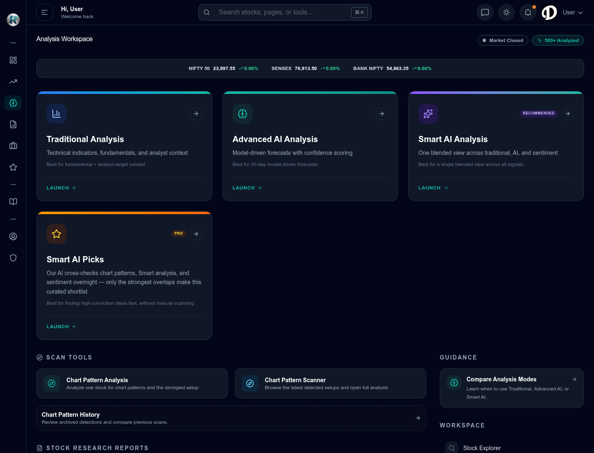

# Stock Analysis

Stock analysis in RightStockAI is not one single report. It is a set of tools that help you answer different research questions about a stock.

Start with the question you want answered, then choose the tool that fits.

## Analysis Workspace

The analysis workspace brings the main research tools together.

*Analysis workspace with stock analysis, AI analysis, Smart AI, chart-pattern, and research report shortcuts.*

## Which Tool Should I Use?

| Your question | Best starting point |
| --- | --- |
| What is the broad market doing? | Dashboard or Markets |
| What is the quick AI view on one stock? | Basic AI Analysis |
| What do finance and technical signals say? | Traditional Analysis |
| What does the deeper AI-assisted report say? | Advanced AI Analysis |
| Do multiple research methods agree? | Smart AI Analysis |
| Is there a chart setup? | Chart Pattern Analysis |
| Did news affect the stock? | AI News |
| What ideas are already available to browse? | Research Reports or Smart AI Picks |

## How to Analyze a Stock

1. Search for the company name or symbol.
2. Confirm you selected the correct listed stock.
3. Choose the analysis tool that matches your question.
4. Read the summary, confidence, reasons, and cautions.
5. Check report age or last update time.
6. Compare another RightStockAI view before acting.
7. Save, watchlist, or revisit the stock if it needs follow-up.

## What to Check on a Stock Page

A stock page or report can contain many sections. You do not need to read everything at once, but you should understand what each area is for.

| Area | What it helps with |
| --- | --- |
| Stock name and symbol | Confirms you opened the correct listed company. |
| Price and change | Shows latest available market movement. |
| Chart | Helps you see trend, volatility, and key price areas. |
| Fundamentals | Helps you understand business quality and valuation. |
| Technical context | Helps you understand price structure and momentum. |
| News | Helps explain recent movement or risk. |
| Recommendation | Summarizes the report's current view. |
| Confidence | Shows how strongly the report's signals align. |
| Risk notes | Shows what could weaken the report's conclusion. |

## Reading Recommendation Labels

Reports may use labels such as bullish, neutral, bearish, buy, hold, or sell-style wording. These labels summarize the report's view.

They are not personal financial advice. The reasons and risk notes matter more than the label alone.

## Report Anatomy

Most useful reports can be read in this structure:

### 1. Summary

The summary is the fastest way to understand the report's direction. Use it to orient yourself, then keep reading.

### 2. Evidence

Evidence explains the data or signals behind the summary. This is where you learn whether the report is convincing.

### 3. Cautions

Cautions explain what may go wrong. A good report should not only say what looks positive.

### 4. Time Context

Markets change. Always check when the report was created or refreshed.

### 5. Next Action

Your next action may be to compare another tool, add to watchlist, check portfolio fit, or do nothing.

## Reading Confidence

Confidence describes signal strength.

- **High confidence:** signals are more aligned.
- **Medium confidence:** useful but not fully clear.
- **Low confidence:** mixed or weak signals.

Confidence does not mean certainty. Always read what could go wrong.

## Comparing Tools

Use comparison when the decision matters.

Examples:

- Traditional Analysis is positive, but AI News is negative.
- Chart Pattern Analysis is bullish, but Smart AI is cautious.
- Advanced AI Analysis has low confidence, but Traditional Analysis is strong.

When reports disagree, do not force a conclusion. Read why they disagree.

## Example Research Paths

### Quick Screening

1. Open Basic AI Analysis.
2. Read the summary and confidence.
3. Add to watchlist only if the idea deserves follow-up.

### Deeper Single-Stock Research

1. Open Traditional Analysis.
2. Open Advanced AI Analysis.
3. Check AI News.
4. Compare with Chart Pattern Analysis.
5. Decide whether the stock is still worth monitoring.

### Portfolio Holding Review

1. Open the stock report for a major holding.
2. Check risk notes.
3. Compare with portfolio concentration.
4. Revisit saved portfolio reports if available.

## Common Mistakes

- Reading only the recommendation label.
- Ignoring report age.
- Treating a target as a guaranteed price.
- Using a chart setup without reading news or risk context.
- Adding a stock to a portfolio before deciding whether it truly fits your holdings.

## Next Steps

- [Traditional Analysis](/features/traditional-analysis)
- [Advanced AI Analysis](/features/ai-analysis)
- [Smart AI Analysis](/features/smart-ai-analysis)
- [Research workflows](/product/research-workflows)
