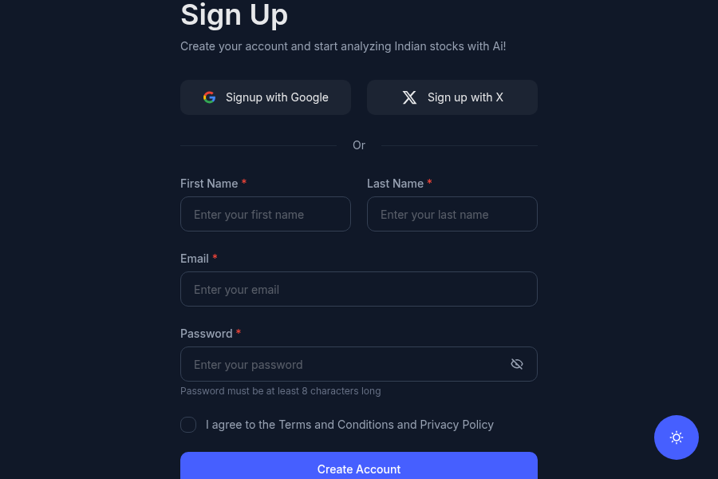

# Account Setup and Sign-In

Use this page when you are new to RightStockAI or when you need help getting back into your account.

This guide focuses only on the setup steps most users need before using the product. Advanced portfolio, chart, report, and analysis settings are explained in their own feature guides.

## What You Need

- An email address you can open immediately.
- Access to the same browser or device where you want to use RightStockAI.
- A stable internet connection.
- A few minutes to confirm your login and review basic settings.

## Create Your Account

*RightStockAI account entry page.*

1. Open [RightStockAI](https://www.rightstockai.com).
2. Select **Sign In**, **Get Started**, or the account option shown on the page.
3. Use the sign-in method available to you.
4. Complete any email verification step shown by the app.
5. After login, open the dashboard and continue with your first setup.

## Sign-In Methods

RightStockAI may show different sign-in choices depending on what is enabled for your account.

### Email Me a Magic Link

Use this option when you want passwordless login.

1. Enter your email address.
2. Select **Email me a magic link**.
3. Open the email from RightStockAI.
4. Click the link in the same browser where you want to use the app.

Magic links expire after a short time for security. If your link does not work, request a new one from the sign-in page.

### Email and Password

If password login is available:

- Use a unique password that you do not reuse on other sites.
- Save it in a password manager.
- Reset the password from the sign-in page if you cannot remember it.

### Social Login

If Google or another social login is shown, use the same sign-in option each time. Signing in with a different email can create or open a different account.

## First Things to Check After Login

### 1. Confirm Your Profile

Open your profile or account settings and confirm:

- Your name or display name.
- Your email address.
- Any optional contact details the app asks you to review.

Only add information that is useful for your account, notifications, or support.

### 2. Check Your Plan

Open **My Subscription** or the pricing page to understand:

- Which plan is active on your account.
- Which tools are available to you.
- Whether a page is fully available, preview-only, locked, or limited by usage rules.

Do not rely on copied pricing text inside documentation. For current plan names, prices, and included limits, use the live pricing page:

[View current pricing](https://www.rightstockai.com/pricing)

### 3. Review Basic Preferences

Set only the preferences you need right away:

- Theme preference, if available.
- Email or browser notifications, if available.
- Default dashboard or research workflow, if available.
- Portfolio display preferences after you create your first portfolio.

You do not need to configure every setting before your first analysis.

## Security Basics

Keep your account safe:

- Use the same email address every time you sign in.
- Do not forward magic links to anyone.
- Use a strong password if your account uses password login.
- Sign out on shared devices.
- Contact support if you see account activity you do not recognize.

## Common Setup Problems

### Magic Link Not Received

- Check your spam, promotions, or updates folder.
- Confirm that you entered the correct email address.
- Wait a minute and request a new link.
- Use the most recent email if you requested multiple links.

### Magic Link Expired

Request a fresh link from the sign-in page. Expired links cannot be reused.

### Logged Into the Wrong Account

Sign out and sign in again using the email address you used when creating the account. If you used social login earlier, use the same sign-in option again.

### A Tool Looks Locked or Limited

Open **My Subscription** or the pricing page to confirm your plan and limits. Some tools may show previews, cooldowns, or usage limits depending on your plan.

### Profile or Settings Are Not Saving

- Refresh the page and try again.
- Check your internet connection.
- Sign out and sign in again.
- Contact support if the issue continues.

## Get Help

Use the support page when login, plan access, or account settings are still unclear:

[Contact RightStockAI support](https://www.rightstockai.com/contact-us)

## Next Steps

After your account is ready:

1. Open [Dashboard Overview](./dashboard.md) to understand the main screen.
2. Follow [Your First Stock Analysis](./first-analysis.md) to run your first research workflow.
3. Read [Plans and Access](../subscription/plans.mdx) if you see locked tools, previews, or usage limits.
