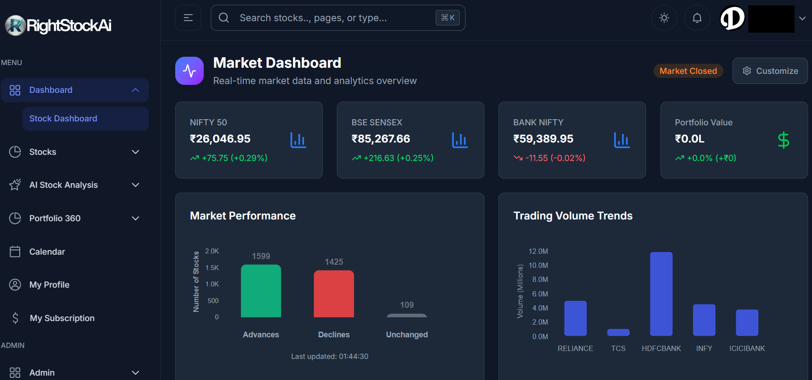
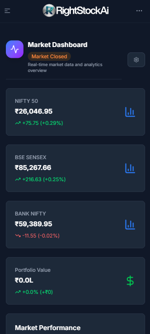

# Navigating RightStockAI

This guide will help you understand the RightStockAI interface and how to move around the platform efficiently.

## Interactive Authentication Flow

RightStockAI provides an interactive session experience that allows you to explore the platform with live access:

### Access Levels
- **Public Pages** - Homepage, pricing, documentation (no login required)
- **Protected Areas** - Dashboard, analysis tools, portfolio management (login required)
- **Trial Access** - 14-day free trial with full feature access
- **Live Demo** - Experience the full interface without commitment

### Authentication Features
- **Secure Login** - Bank-grade security with better-auth framework
- **Quick Signup** - Seamless account creation with email verification
- **Social Login Options** - Multiple authentication methods available
- **Session Management** - Secure session handling with automatic timeouts

### Protected Content Access
When you try to access protected areas without authentication, RightStockAI presents a login interface that:
- Prompts you to sign up or sign in
- Provides clear value proposition for creating an account
- Offers the 14-day free trial to explore full features
- Maintains security while encouraging user engagement

## Platform Layout Overview

RightStockAI uses a clean, intuitive design that works seamlessly across desktop, tablet, and mobile devices.

### Desktop Layout

*RightStockAI desktop dashboard showing the full interface with market overview, portfolio widgets, and navigation*

### Mobile Layout

*RightStockAI mobile dashboard optimized for touch interactions with responsive design*

On mobile devices, the layout adapts:
- Header collapses to hamburger menu
- Content stacks vertically
- Touch-friendly buttons and gestures

## Top Navigation Bar

The navigation bar is your primary way to move between major sections.

### Logo & Branding
- **RightStockAI Logo** - Click to return to homepage
- **Tagline** - "AI-Powered Stock Analysis for Indian Markets"

### Main Navigation Menu
- **Dashboard** - Your personalized overview
- **Analysis** - Stock analysis tools
- **Portfolio** - Portfolio management
- **Watchlist** - Watchlist management
- **Markets** - Market overview and indices

### User Menu (Top Right)
- **Profile Picture/Initials** - Click for user menu
- **Settings** - Account and app preferences
- **Help** - Access this help center
- **Logout** - Sign out of your account

### Search Bar
- **Global Search** - Search stocks by name or symbol
- **Quick Access** - Instant analysis from any page
- **Auto-complete** - Suggestions as you type

## Dashboard Overview

The dashboard is your command center when you log in.

### Market Overview Widget
- **NIFTY 50** - Current value, change, % change
- **Sensex** - Current value, change, % change
- **Top Gainers/Losers** - Market movers
- **Sector Performance** - Heat map of sectors

### Your Portfolios Widget
- **Portfolio List** - Quick view of all portfolios
- **Total Value** - Combined portfolio value
- **Day's Change** - Overall performance
- **Top Holdings** - Your largest positions

### Recent Activity
- **Latest Analyses** - Your recent stock analyses
- **Portfolio Updates** - Recent transactions
- **Alerts** - Price alerts and notifications
- **Market News** - Relevant market updates

### Quick Actions
- **Analyze Stock** - Jump to analysis
- **Add Holding** - Record a purchase
- **Create Watchlist** - Start a new watchlist
- **View Markets** - Market overview

## Stock Analysis Interface

Access stock analysis through multiple paths:
- Search bar → Select stock → Analysis
- Dashboard → Quick Actions → Analyze Stock
- Navigation → Analysis → Search

### Analysis Tabs
1. **Overview** - Key metrics and summary
2. **AI Analysis** - AI predictions and insights
3. **Technical** - Charts and indicators
4. **News** - Related news and updates
5. **Compare** - Side-by-side comparisons

### Chart Controls
- **Timeframe Selector** - 1D, 1W, 1M, 3M, 6M, 1Y, 5Y
- **Chart Type** - Line, Candlestick, Bar
- **Indicators** - Add/remove technical indicators
- **Drawing Tools** - Trend lines, annotations

### AI Insights Panel
- **Prediction Summary** - Key takeaways
- **Confidence Levels** - How sure the AI is
- **Supporting Data** - What influenced the prediction
- **Risk Factors** - Potential downsides

## Portfolio Management

### Portfolio List View
- **Portfolio Cards** - Visual portfolio summaries
- **Performance Charts** - Value over time
- **Holdings Table** - Detailed position breakdown
- **Actions Menu** - Edit, delete, analyze

### Adding Holdings
1. **Manual Entry**
   - Stock symbol or name
   - Purchase date
   - Quantity and price
   - Brokerage fees (optional)

2. **Bulk Import**
   - CSV upload
   - Excel template
   - Broker statements

### Portfolio Analysis
- **Performance Metrics** - Returns, volatility, Sharpe ratio
- **Sector Allocation** - Pie chart of sectors
- **Asset Allocation** - Stocks vs cash
- **Geographic Exposure** - If applicable

## Watchlist Management

### Creating Watchlists
- **Strategy-based** - Growth, Value, Dividend
- **Sector-based** - IT, Banking, Pharma
- **Custom** - Your own criteria

### Watchlist View
- **Stock List** - Current prices and changes
- **Alerts Column** - Active alerts
- **Quick Actions** - Analyze, add to portfolio
- **Sorting Options** - By name, price, change

### Setting Alerts
- **Price Alerts** - Above/below target price
- **Percentage Alerts** - % change thresholds
- **Volume Alerts** - Unusual trading volume
- **Technical Alerts** - RSI levels, moving average crosses

## Mobile Navigation

RightStockAI is fully responsive and optimized for mobile use.

### Mobile Menu
- **Hamburger Icon** - Tap to open navigation
- **Slide-out Menu** - Full navigation options
- **Quick Access** - Frequently used features

### Touch Gestures
- **Swipe Left/Right** - Navigate between tabs
- **Tap and Hold** - Context menus
- **Pinch to Zoom** - Chart zooming
- **Double Tap** - Quick actions

### Mobile-Specific Features
- **Pull to Refresh** - Update data
- **Swipe to Delete** - Remove items
- **Tap to Expand** - Detailed views
- **Bottom Navigation** - Quick access bar

## Keyboard Shortcuts

Power users can use keyboard shortcuts for efficiency:

### Global Shortcuts
- **Ctrl/Cmd + K** - Open search
- **Ctrl/Cmd + D** - Go to dashboard
- **Ctrl/Cmd + A** - New analysis
- **Ctrl/Cmd + P** - Portfolio view
- **Ctrl/Cmd + W** - Watchlist view

### Analysis Shortcuts
- **1-5** - Switch between analysis tabs
- **+/-** - Zoom chart in/out
- **Arrow Keys** - Pan chart
- **Space** - Pause/resume auto-refresh

## Accessibility Features

RightStockAI is committed to accessibility:

### Screen Reader Support
- **ARIA Labels** - Proper labeling for screen readers
- **Semantic HTML** - Logical document structure
- **Keyboard Navigation** - Full keyboard access

### Visual Accessibility
- **High Contrast Mode** - Better visibility
- **Font Size Options** - Adjustable text size
- **Color Blind Support** - Accessible color schemes

### Motor Accessibility
- **Large Click Targets** - Easy tapping
- **Reduced Motion** - For motion sensitivity
- **Voice Commands** - Future feature

## Customizing Your Experience

### Dashboard Layout
- **Rearrange Widgets** - Drag and drop
- **Resize Widgets** - Adjust sizes
- **Hide/Show Widgets** - Customize view

### Theme Preferences
- **Light/Dark Mode** - Automatic or manual
- **Color Scheme** - Professional or colorful
- **Font Choices** - Readability options

### Notification Settings
- **Email Alerts** - Price alerts via email
- **Push Notifications** - Browser notifications
- **SMS Alerts** - Premium feature

## Troubleshooting Navigation Issues

### Common Issues

**Menu Not Loading**
- Refresh the page
- Clear browser cache
- Check internet connection

**Search Not Working**
- Check spelling
- Try symbol instead of name
- Use NSE/BSE prefixes

**Mobile Menu Stuck**
- Close and reopen browser
- Clear app data (if using PWA)
- Update to latest app version

### Getting Help
- **Help Button** - In-app help
- **Support Chat** - Live assistance
- **Documentation** - This help center
- **Community Forum** - User discussions

## Best Practices for Navigation

### Efficiency Tips
1. **Use Search** - Fastest way to find stocks
2. **Bookmark Important Pages** - Quick access
3. **Set Up Alerts** - Stay informed passively
4. **Customize Dashboard** - Focus on what matters

### Organization Tips
1. **Logical Portfolio Names** - Easy identification
2. **Consistent Watchlist Naming** - Clear categories
3. **Regular Cleanup** - Remove unused items
4. **Backup Settings** - Export preferences

## Next Steps

Now that you know how to navigate:

1. **[Your First Analysis](/getting-started/first-analysis)** - Put navigation into practice
2. **[Account Setup](/getting-started/account-setup)** - Customize your experience
3. **[Stock Analysis Overview](/features/stock-analysis)** - Deep dive into analysis tools

---

**Navigation Tips:** Use the search bar for instant access to any feature or stock.