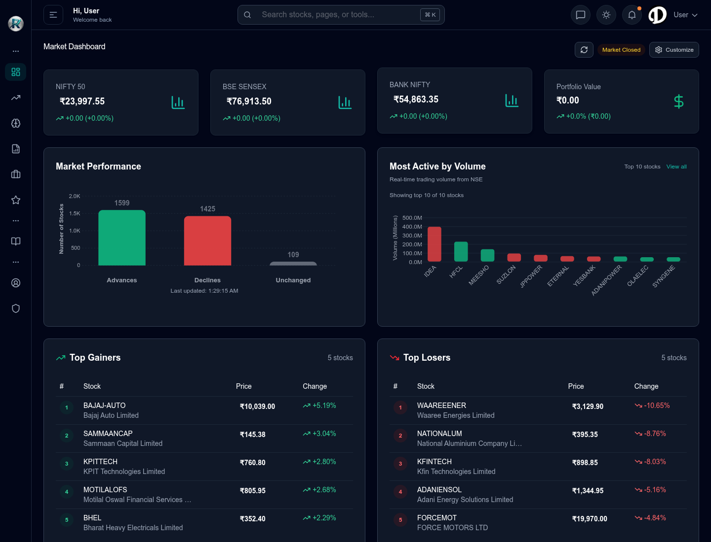
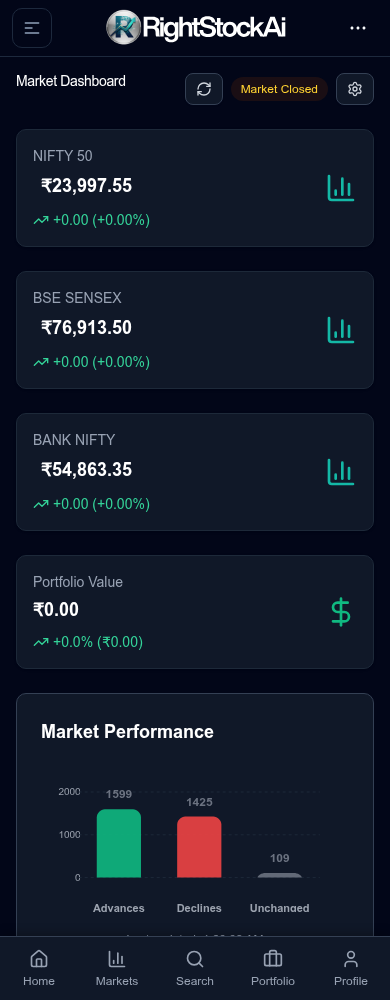

# Navigating RightStockAI

RightStockAI is organized around a few everyday jobs: checking the market, researching a stock, tracking a portfolio, building a watchlist, and learning how to use the tools.

## Desktop Layout

*Desktop view with market dashboard, search, side navigation, and market widgets.*

On desktop, most navigation happens from three places:

- **Side menu:** opens major areas such as Dashboard, Stocks, Analysis Tools, Research & Picks, Portfolio, Watchlist, and Learn & Support.
- **Search bar:** helps you find stocks, pages, or tools quickly.
- **Top controls:** show market status and common actions such as refresh, theme, and account access.

## Mobile Layout

*Mobile view with stacked market cards and bottom navigation.*

On mobile, the layout is simplified:

- **Bottom navigation** gives fast access to Home, Markets, Search, Portfolio, and Profile.
- **Menu button** opens the wider app menu.
- **Cards stack vertically** so market data remains readable.
- **Search** is usually the fastest way to open a stock or research tool.

## Main Areas

### Dashboard

Use the dashboard for a quick market read: index values, market breadth, active-volume stocks, gainers, and losers.

Start here when you do not yet know which stock to research.

### Stocks

Use stock pages when you want to inspect one company more closely. A stock page may include price context, charts, company details, news, and links into analysis tools.

Use this area when you already know the company name or symbol.

### Analysis Tools

Use analysis tools when you want a structured report. RightStockAI includes traditional analysis, AI-assisted analysis, smart blended analysis, chart-pattern research, and research report views.

Use this area when your goal is a report rather than browsing market movement.

### Research & Picks

Use research and picks pages when you want curated ideas, recent research reports, or shortlist-style views. These pages are research aids, not automatic trading instructions.

### Portfolio

Use portfolio tools to track holdings, understand exposure, and review performance. Portfolio research is most useful after you add your actual holdings.

### Watchlist

Use watchlists for stocks you want to monitor before taking action. A watchlist is useful for ideas, alerts, and follow-up research.

### Learn & Support

Use the help center when you want product guidance, investing concepts, AI limitations, troubleshooting, or support contact options.

## Navigation Map by Task

| Task | Start here |
| --- | --- |
| Check market direction | Dashboard or Markets |
| Search one company | Search bar or Stocks |
| Run a full report | Analysis Tools |
| Browse saved or shared research | Research & Picks |
| Review holdings | Portfolio |
| Monitor ideas | Watchlist |
| Understand a term | Learn & Support |
| Resolve access or sign-in issue | Help or Contact Support |

## Fastest Ways to Move Around

1. Use search when you know the stock or tool name.
2. Use the dashboard when you want a market overview first.
3. Use Analysis Tools when you already know you want a report.
4. Use Portfolio or Watchlist when you are reviewing stocks you already follow.
5. Use Learn & Support when a term, result, or locked feature is unclear.

## Locked or Limited Tools

Some tools may show a lock, plan message, or usage message. That means the tool is not currently available for your account level or you have reached your current usage allowance.

When that happens:

- Read the message shown on the page.
- Open the live pricing page for current plan details.
- Contact support if you believe the tool should be available to you.

## Desktop vs Mobile Habits

Desktop is better for:

- Comparing more than one report.
- Reading wider tables.
- Reviewing charts.
- Uploading portfolio files.

Mobile is better for:

- Quick market checks.
- Opening a saved report.
- Searching a stock quickly.
- Reviewing watchlist ideas.

If a chart or table feels cramped on mobile, use desktop for that task.

## Navigation Tips

- Keep stock research and portfolio review separate. A strong stock report does not automatically mean it fits your portfolio.
- Check the report date or last update time before relying on a result.
- Compare more than one research view when the decision matters.
- Use watchlists for ideas you are not ready to add to a portfolio.

## Next Steps

- [Dashboard overview](/getting-started/dashboard)
- [Run your first stock analysis](/getting-started/first-analysis)
- [Tools and terms](/product/tools-and-terms)
