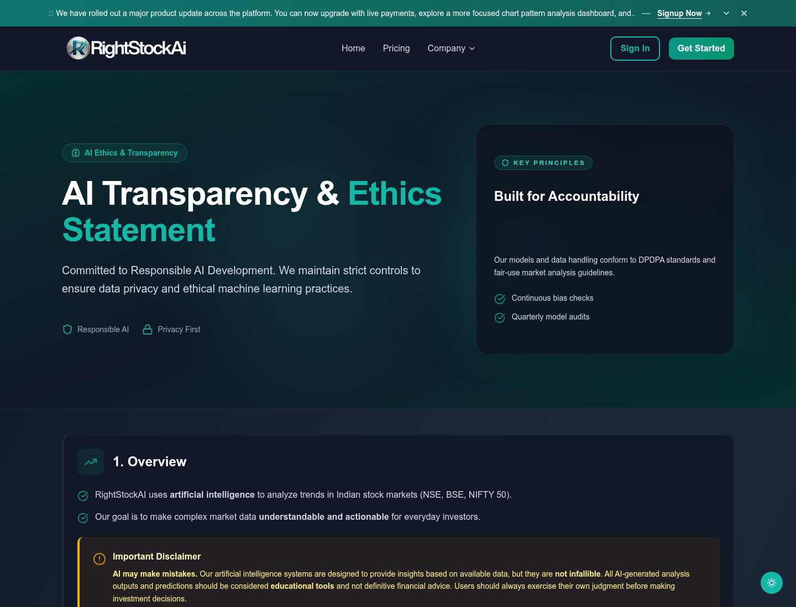
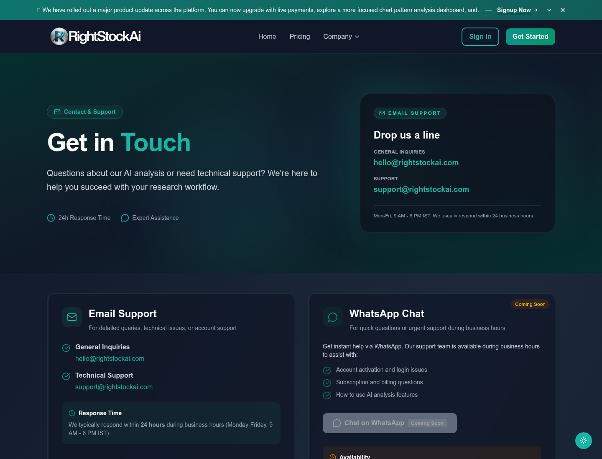

# Public Pages and Policies

RightStockAI has public pages that can be opened without signing in. Use them when you need product information, pricing, legal terms, support contact, or privacy instructions before logging in.

## Public Homepage

The homepage introduces RightStockAI, the main product value, and entry points for signup, pricing, and product exploration.

Use the homepage when you want to:

- Understand what RightStockAI does.
- Start signup.
- Navigate to Pricing.
- Find public product pages.
- Confirm you are on the official RightStockAI website.

Official URL: [https://www.rightstockai.com](https://www.rightstockai.com)

## Pricing Page

The Pricing page is the best place to check current plan prices, offers, and included limits.

This documentation does not copy pricing numbers because stale pricing creates user confusion. If a help article and the live Pricing page ever appear different, use the live Pricing page.

Official URL: [https://www.rightstockai.com/pricing](https://www.rightstockai.com/pricing)

Use Pricing when you need:

- Current plan comparison.
- Current paid-plan prices.
- Current trial information.
- Current usage allowances.
- Current upgrade path.
- Billing-cycle details.

## AI Transparency

AI Transparency explains how users should think about AI-assisted output in RightStockAI.

Use this page when you want to understand:

- What AI can help with.
- What AI cannot guarantee.
- Why reports should be treated as research support.
- Why users should check risk, confidence, data freshness, and personal context.
- Why recommendations are not personalized financial advice.

Official URL: [https://www.rightstockai.com/ai-transparency](https://www.rightstockai.com/ai-transparency)

## Contact Us

Contact Us is the public support route for users who cannot sign in or need to reach RightStockAI before creating an account.

Use Contact Us when:

- You cannot sign in.
- You did not receive a magic link.
- You have billing questions before logging in.
- You need help with account access.
- You want to ask about the product before signup.

Official URL: [https://www.rightstockai.com/contact-us](https://www.rightstockai.com/contact-us)

If you can sign in, the in-app Support page is usually better because support can connect the request to your account.

## About Us

About Us gives background on the product and company direction.

Official URL: [https://www.rightstockai.com/about-us](https://www.rightstockai.com/about-us)

Use it when you want to understand the product mission and who the platform is built for.

## Terms Of Use

Terms of Use explain the rules for using RightStockAI.

Official URL: [https://www.rightstockai.com/terms-of-use](https://www.rightstockai.com/terms-of-use)

Read it when you need to understand:

- Account responsibilities.
- Acceptable use.
- Platform restrictions.
- Billing and subscription obligations.
- Legal responsibilities.

## Disclaimer

Disclaimer explains important limits of RightStockAI research output.

Official URL: [https://www.rightstockai.com/disclaimer](https://www.rightstockai.com/disclaimer)

Read it before relying on reports. RightStockAI provides research tools and analysis context. It does not place trades and does not replace professional financial advice.

## Privacy Policy

Privacy Policy explains how user data is handled.

Official URL: [https://www.rightstockai.com/privacy-policy](https://www.rightstockai.com/privacy-policy)

Read it when you need to understand:

- What account data may be collected.
- How data may be used.
- Privacy rights and choices.
- How to contact the team about privacy concerns.

## Data Deletion Instructions

Data Deletion Instructions explain how users can request deletion of account-related data.

Official URL: [https://www.rightstockai.com/data-deletion-instructions](https://www.rightstockai.com/data-deletion-instructions)

Use this page when:

- You want to delete account data.
- You want to understand the request process.
- You need to contact the team about privacy or deletion.

## Sign In, Sign Up, And Magic Links

Authentication pages are public, but account areas require login.

Common public auth routes include:

- Sign In: [https://www.rightstockai.com/signin](https://www.rightstockai.com/signin)
- Sign Up: [https://www.rightstockai.com/signup](https://www.rightstockai.com/signup)

RightStockAI also supports signing in with "Email me a magic link." Enter your email, open the newest email from RightStockAI, and use the link before it expires.

If a magic link fails:

1. Request a fresh link.
2. Use the newest email only.
3. Open it in the same browser if possible.
4. Check spam or promotions folders.
5. Contact support if links do not arrive.

## Which Page Should I Use?

| Need | Use this page |
| --- | --- |
| Current plan prices or allowances | [Pricing](https://www.rightstockai.com/pricing) |
| Product overview | [Homepage](https://www.rightstockai.com) |
| AI reliability and limitations | [AI Transparency](https://www.rightstockai.com/ai-transparency) |
| Public support | [Contact Us](https://www.rightstockai.com/contact-us) |
| Legal usage rules | [Terms of Use](https://www.rightstockai.com/terms-of-use) |
| Research and investment disclaimer | [Disclaimer](https://www.rightstockai.com/disclaimer) |
| Privacy handling | [Privacy Policy](https://www.rightstockai.com/privacy-policy) |
| Delete account data | [Data Deletion Instructions](https://www.rightstockai.com/data-deletion-instructions) |

## Best Practice

Use docs for learning product terms and workflows. Use the RightStockAI website for current pricing, legal policies, support, and account actions.
